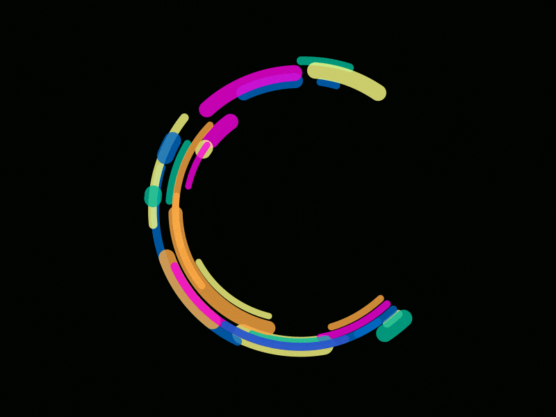

### Hi, I’m Cat Nguyen 👋
  - Front-end Developer
  - Passionate about creating user-friendly websites with a 3D touch 🌏🎨
  - Embracing growth, open to new ideas, and eager to learn from others 🌱

## 📦 My Toolbox
- **Languages:** `CSS` `JavaScript` `TypeScript` `Python` `SQL`  
- **Libraries & Frameworks:** `React.js` `Next.js` `Three.js` `GSAP`
- **Styling:** `Tailwind CSS` `GSAP`
- **Version Control:** `Git` `GitLab`  
- **Others:** `Blender` `Figma` `Unity`  

## ✨ Fun Facts
- In my free time, you'll find me exploring cool 3D designs and honing my skills in Blender.

### Visit my website here:
- [My Website](https://nguyencatnguyen.github.io/CatNguyen/index.html)  
- Let's connect and create something amazing together! 🌟💻
